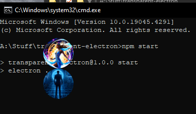

# A transparent draggable or click through electron app



## Usage

```
npm install
npm start
```

# How to switch between draggable mode to click through mode?

Simply toggle the newly added `draggable` option to the settings to switch between draggable / click through mode

```
    draggable: true,
```

# Credits:

Burgil, for investing so much time into this simple thing

# View the overlays:

Change:

```css
        .draggable-image .no-drag {
            -webkit-app-region: no-drag;
            position: absolute;
            width: 7.5px;
            height: 7.5px;
            background: transparent;
        }
        .draggable-image .no-drag::after {
            content: '';
            -webkit-app-region: no-drag;
            position: absolute;
            width: 5.625px;
            height: 5.625px;
            background: transparent;
        }
        .draggable-image .no-drag::before {
            content: '';
            -webkit-app-region: no-drag;
            position: absolute;
            background: transparent;
        }
```

To:

```css
        .draggable-image .no-drag {
            -webkit-app-region: no-drag;
            position: absolute;
            width: 7.5px;
            height: 7.5px;
            background: white;
        }
        .draggable-image .no-drag::after {
            content: '';
            -webkit-app-region: no-drag;
            position: absolute;
            width: 5.625px;
            height: 5.625px;
            background: green;
        }
        .draggable-image .no-drag::before {
            content: '';
            -webkit-app-region: no-drag;
            position: absolute;
            background: yellow;
        }
```